<h1 align="center">Hi 👋, I'm Manjunath Neeli</h1>

  

## 🎓 AI & Data Science Student

🚀 Learning:
- Python
- Java
- C
- cybersecurity
- AI & Machine Learning
- Data Structures & Algorithms
- Data science

- ## 🛠️ Languages & Tools

  

## 📊 GitHub Metrics

  

## 🏆 GitHub Trophies

  

## 🔥 GitHub Streak

  

💻 Currently Building:
- 🤖 MAI AI Assistant
- 🌱 CropThirst Smart Irrigation System

📫 Reach me:
- GitHub: https://github.com/Shetty22

